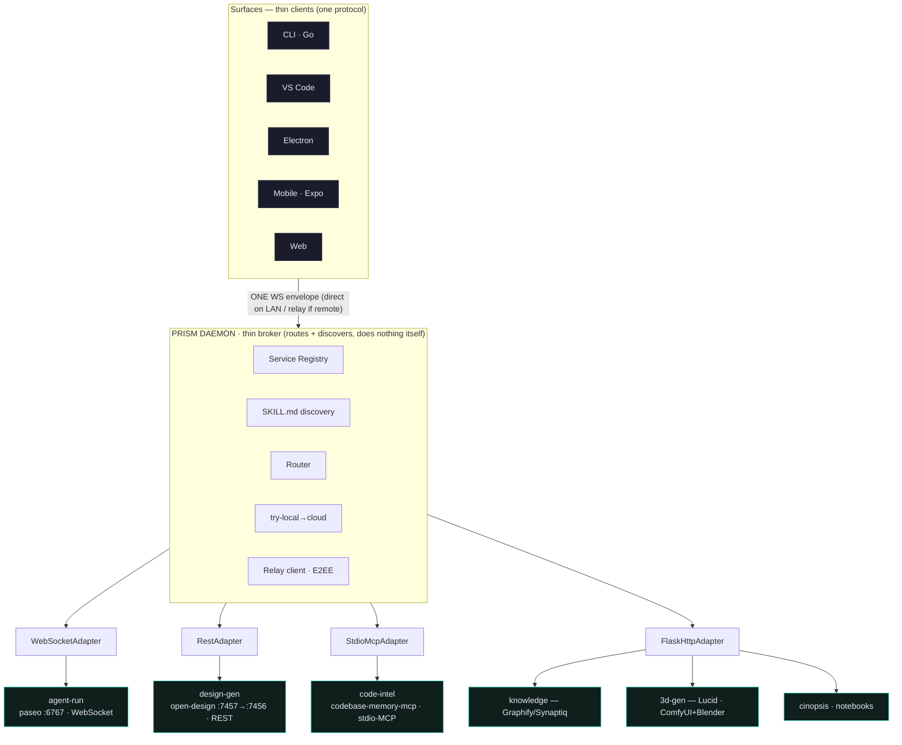
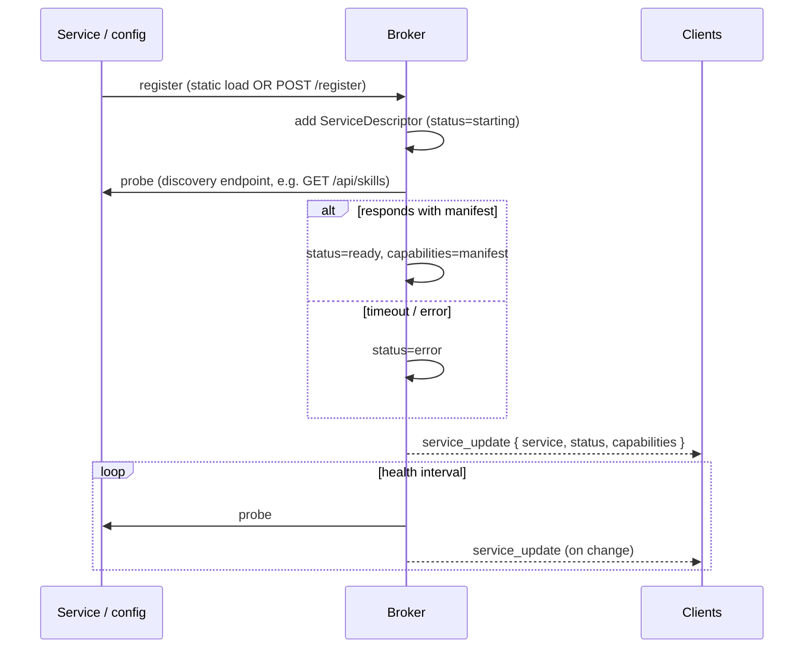
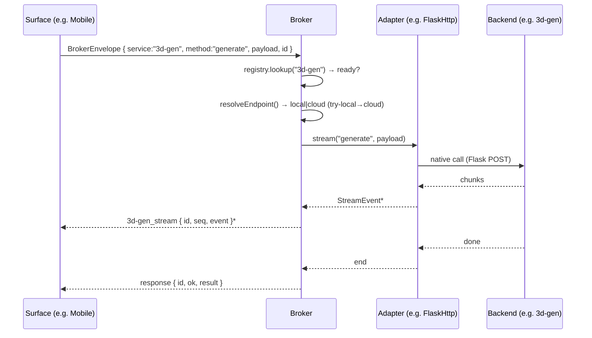

# Prism Daemon-Broker — Technical Specification

**Version:** 1.0
**Date:** 2026-06-12
**Status:** Draft — ready for `/prism-plan`
**Ledger:** `.prism/shared/brainstorms/2026-06-12-code-intel-memory-layer.md` (Q1–Q5 locked)
**Worklist:** `.prism/shared/handoffs/2026-06-12-daemon-memory-arc-worklist.md`

---

## 1. Overview

### 1.1 Purpose
Define the architecture of the **Prism Daemon** — a sovereign, self-hosted, local-first **multi-service broker** that every Prism surface (CLI, VS Code, Electron, Mobile, Web) connects to over one protocol. The daemon owns nothing itself; it **routes and discovers**. Each capability (agent-run, design-gen, code-intel, knowledge, 3D-gen, …) is a **service** reached through a per-service **adapter** that speaks the service's native protocol.

### 1.2 Locked Decisions (from ledger §1 — do not re-litigate)
- **Q1** Code-intel is a daemon-**brokered service**, not in-process-only.
- **Q2** The daemon is a **multi-service broker** that normalizes N donor protocols → **one** client protocol.
- **Q3** Memory = **layer both**: codebase-memory-mcp = code-intel service; Graphify = knowledge/STORE service powering Synaptiq.
- **Q4** Fork Graphify (MIT) sovereignly.
- **Q5** Build = **thin broker/registry-spine + per-service relays/adapters** (NOT extend-paseo, NOT a monolith).

### 1.3 Invariant
**Sovereignty:** Prism-owned end-to-end, self-hosted on DO/Coolify. Donors (paseo, open-design, Graphify, codebase-memory-mcp, …) are **absorbed as backends**, never external dependencies traffic routes through. Local-first; relay is self-hosted (`prism.digitalgriot.studio`).

### 1.4 Fragment-Template DNA
The broker + adapter interface + relay + client lib + surface set is a **reusable template**. Fragment scaffolds a new Griot tool → it gets the spine, the adapters, the client, and the surfaces; the tool registers its own services. Design every contract below to be tool-agnostic.

---

## 2. Architecture

### 2.1 Runtime Topology



### 2.2 The Thin-Broker Principle
The broker is a **registry + router + discovery service + relay client** — nothing more. All real work happens in backends, reached through adapters. This keeps the **next fold a new adapter registration, never a daemon rewrite** — the property that makes it Fragment-templatable.

### 2.3 Technology Basis
- **Language:** TypeScript/Node (reuses paseo's `packages/server` client + relay primitives, already vendored in `apps/prism-mobile/`).
- **Reuse:** paseo's WS envelope, binary-mux, capability-gating, and the E2EE relay (`apps/prism-mobile/packages/relay`).
- **Cross-language note:** the **Go CLI** consumes the broker via a thin Go WS client (re-implements the envelope) OR shells out to a Node client. (Tracked as a plan risk — see §13.)

---

## 3. Client Protocol (Pillar 1)

### 3.1 Envelope
One envelope for every surface↔broker message. The **`service`** field is the routing key (this is the extension over paseo's agent-only envelope).

```ts
interface BrokerEnvelope {
  id: string;          // correlation id (request ↔ response/stream)
  service: ServiceId;  // "agent-run" | "design-gen" | "code-intel" | "knowledge" | "3d-gen" | "cinopsis" | ...
  method: string;      // service-scoped, e.g. "chat" | "trace" | "query" | "launch" | "stop"
  payload: unknown;    // method-specific (validated by the service's manifest)
  caps?: string[];     // optional capability assertions for wire gating
  ts: number;
}
```

### 3.2 Handshake
```
Client → Broker:  WSHello   { clientId, version, caps: CLIENT_CAPS[] }
Broker → Client:  WSWelcome { brokerVersion, sessionId, services: ServiceDescriptor[], capabilities }
```
`WSWelcome` ships the **live registry snapshot** — a freshly-connected surface immediately knows every available service and its capabilities (no extra round-trip).

### 3.3 Message Types
| Direction | Type | Shape |
|---|---|---|
| C→B | `request` | `BrokerEnvelope` (unary or stream-initiating) |
| B→C | `response` | `{ id, ok, result | error }` |
| B→C (push) | `service_update` | `{ service, status, capabilities? }` |
| B→C (push) | `<service>_stream` | `{ service, id, seq, event }` — append-only timeline |
| B→C (push) | `permission_request` | `{ service, id, prompt }` |
| C→B | `permission_response` | `{ id, decision }` |

### 3.4 Binary Multiplexing
Terminal I/O and bulk streams share the connection via paseo's `BinaryMuxFrame` (channel 0 = control, channel 1 = terminal; 1-byte channel + 1-byte flags + payload). Unchanged from paseo.

### 3.5 Compatibility (inherited rule — non-negotiable)
Schemas are **append-only**. Add fields, never remove, never make optional→required, never narrow types. New wire enums gated at serialization via `session.supports(CLIENT_CAPS.x)`. The wire boundary asks one question: *"does a 6-month-old client still parse this?"* Required because old mobile clients talk to new brokers.

---

## 4. Service Registry + SKILL.md Discovery (Pillar 2)

### 4.1 Data Model
```ts
type ServiceId = string;
type AdapterType = "websocket" | "rest" | "stdio-mcp" | "flask-http";

interface ServiceDescriptor {
  id: ServiceId;
  name: string;
  status: "stopped" | "starting" | "ready" | "error";
  adapterType: AdapterType;
  endpoint: { local?: string; cloud?: string };
  capabilities: SkillManifestEntry[];   // sourced from SKILL.md / GET /api/skills
  gate?: ServiceGate;                    // see §6
  healthProbe: string;                   // e.g. "GET /api/skills"
  lastProbe?: { at: number; ok: boolean; latencyMs: number; via: "local" | "cloud" };
}

interface SkillManifestEntry { name: string; description: string; methods: string[]; }
```

### 4.2 Discovery = Readiness
A service is **ready** when it answers its discovery endpoint with its capability manifest. **design-gen already proves this**: `GET /api/skills` returns the SKILL.md set; if it responds, the engine is genuinely ready to accept work (not merely port-bound). The broker uses the discovery endpoint as the health probe. SKILL.md is therefore the **capability + readiness contract** across all services.

### 4.3 Registry Lifecycle
Registry is an in-memory `Map<ServiceId, ServiceDescriptor>` (persisted snapshot for restart). Pushed to clients on `WSWelcome` and on every `service_update`.

---

## 5. Adapter Contract (Pillar 3)

### 5.1 Interface
```ts
interface Adapter {
  readonly type: AdapterType;
  connect(desc: ServiceDescriptor): Promise<void>;
  probe(desc: ServiceDescriptor): Promise<ProbeResult>;          // readiness via discovery endpoint
  describe(): Promise<SkillManifestEntry[]>;                     // capabilities (SKILL.md)
  call(method: string, payload: unknown): Promise<unknown>;      // unary
  stream(method: string, payload: unknown): AsyncIterable<StreamEvent>;  // streaming
  disconnect(): Promise<void>;
}

interface ProbeResult { ok: boolean; via: "local" | "cloud"; latencyMs: number; manifest?: SkillManifestEntry[]; }
interface StreamEvent { seq: number; kind: string; data: unknown; }
```

### 5.2 Implementations (4 families)
| Adapter | Backend(s) | Native protocol | Notes |
|---|---|---|---|
| `WebSocketAdapter` | agent-run (paseo) | WebSocket `:6767` | wraps paseo daemon-client |
| `RestAdapter` | design-gen (open-design) | REST `:7457`→`:7456` | **the `design-studio :7457` relay, formalized** as an adapter |
| `StdioMcpAdapter` | code-intel (codebase-memory-mcp) | stdio-MCP | spawns + speaks MCP; maps tools→methods |
| `FlaskHttpAdapter` | knowledge (Graphify/Synaptiq), 3d-gen (Lucid), cinopsis, notebooks | Python/Flask HTTP | **ONE adapter** parameterized by `{ port, manifestPath, spawnCmd? }` |

The `FlaskHttpAdapter` collapsing four Python services into one adapter is the single biggest leverage point — Cinopsis (already Flask), ComfyUI/3D, Graphify, and notebooks all plug in identically.

---

## 6. try-local→cloud (Pillar 4)

```ts
interface ServiceGate { kind: "vram" | "binary" | "custom"; min?: number; check?: () => boolean; }

async function resolveEndpoint(desc: ServiceDescriptor): Promise<{ url: string; via: "local" | "cloud" }> {
  if (desc.endpoint.local && passesGate(desc.gate)) {
    const ok = await probeWithin(desc.endpoint.local, desc.healthProbe, /*ms*/ 1500); // AbortSignal.timeout
    if (ok) return { url: desc.endpoint.local, via: "local" };
  }
  if (desc.endpoint.cloud) return { url: desc.endpoint.cloud, via: "cloud" };
  throw new ServiceUnavailable(desc.id);
}
```
- **Gate examples:** 3D-gen `{ kind: "vram", min: 24 }` (full Pixal3D/Kimono) → cloud (RunPod/HF) when local GPU is short; `{ kind: "vram", min: 6 }` for GGUF stays local.
- The 1.5 s `AbortSignal.timeout` probe is the idea_init `_probeEngine` pattern, generalized. Result cached in `descriptor.lastProbe`.

---

## 7. Relay (Pillar 5)
- Reuse paseo's E2EE relay (`apps/prism-mobile/packages/relay`): ECDH key exchange + AES-256-GCM, zero-knowledge router (Cloudflare adapter or self-hosted Go relay).
- Broker dials **outbound** to `prism.digitalgriot.studio/relay` (your self-hosted infra — the 2 relay path-mount commits already in the fork).
- **LAN** clients connect to the broker directly; **remote** clients connect via the relay. Same `BrokerEnvelope` on the wire either way. Pairing via QR (transfers the broker's public key).

---

## 8. Registration / Deregistration (Pillar 6)

### 8.1 Two paths
- **Static:** `services.config.json` read on boot — `[{ id, adapterType, endpoint, manifestPath, gate, spawnCmd? }]`.
- **Dynamic:** `POST /register { id, adapterType, endpoint, manifest }` (e.g. design-studio self-registers).

### 8.2 Flow


---

## 9. Sequence — a client call routed through the broker



---

## 10. In-Flight Contract Mapping — DesignEngineHost → broker

The idea_init session wired 6 messages inline in `PrismPanelProvider.ts` against the `design-studio :7457` relay. Under the broker these become routed `design-gen.*` calls (the panel host becomes a thin broker client):

| DesignEngineHost message | Broker call |
|---|---|
| `requestDesignEngineState` | `registry.query("design-gen")` + `design-gen.state` |
| `launchDesignEngine` | `design-gen.launch` |
| `stopDesignEngine` | `design-gen.stop` |
| `sendDesignPrompt` | `design-gen.chat { brief, design_system, type }` |
| `openDesignArtifact` | client-side (`openExternal` / `showDocument`) |
| `openFile` | client-side (`showDocument`) |

Migration is non-breaking: the inline relay calls are swapped for broker envelopes; `GET /api/skills` readiness becomes the broker's probe for the design-gen descriptor.

---

## 11. Error Handling
```ts
interface BrokerError { code: BrokerErrorCode; service?: ServiceId; message: string; details?: unknown; }
type BrokerErrorCode =
  | "SERVICE_NOT_FOUND" | "SERVICE_UNAVAILABLE" | "ADAPTER_ERROR"
  | "GATE_FAILED" | "METHOD_NOT_FOUND" | "PAYLOAD_INVALID" | "RELAY_ERROR" | "UNAUTHORIZED";
```
- Unknown/unready service → `SERVICE_UNAVAILABLE` with the descriptor status (so the client can offer "launch").
- Local gate miss + no cloud → `GATE_FAILED` (e.g. "needs 24GB VRAM, no cloud endpoint configured").
- Adapter exceptions normalized to `ADAPTER_ERROR` with the backend's message.

## 12. Security
- **Transport:** localhost binding by default; remote only via the E2EE relay. Wildcard CORS only in dev.
- **Auth:** optional broker password (paseo pattern); injected-agent MCP authenticated when a password is set.
- **Capability gating:** `session.supports()` at the wire boundary; new enums never sent to old clients.
- **Sovereignty:** no telemetry; all backends local or on your infra; relay zero-knowledge.

---

## 13. Module / File Boundaries (proposed)
```
packages/prism-daemon/                 # the broker (TS)
  src/broker.ts                        # registry + router + welcome
  src/registry.ts                      # ServiceDescriptor store + lifecycle
  src/discovery.ts                     # SKILL.md / /api/skills probing
  src/resolve.ts                       # try-local→cloud
  src/adapters/{websocket,rest,stdio-mcp,flask-http}.ts
  src/protocol.ts                      # BrokerEnvelope + handshake + push types
  services.config.json                 # static service registry
packages/prism-daemon-client/          # shared client lib (TS) — VSCode/Electron/Mobile/Web
apps/prism-mobile/packages/relay/      # REUSED E2EE relay
apps/prism-cli/...                     # Go WS client (thin) — see risk below
```
**Fragment extraction target:** `packages/prism-daemon/` + `packages/prism-daemon-client/` + the adapter set + relay = the scaffold a new Griot tool inherits.

---

## 14. Deferred Concerns (from ledger §2 — carried verbatim, first-class)
1. **design-gen broker-integration** — VSCode wiring done (`PrismPanelProvider`, `/api/skills` probe). Pending: register design-gen as a formal relay behind the broker (§10 is the migration map). *Revisit: during implementation.*
2. **How Synaptiq wraps Graphify** — Synaptiq's agentic visual canvas over Graphify's engine: node model, cross-project addressing, vector/hybrid-search layer. *Revisit: Synaptiq design phase.*

**Open risk (new, for the plan):**
- **Go CLI client** — Go cannot import the TS `prism-daemon-client`. Decide: hand-write a Go WS client (re-implement `BrokerEnvelope`) vs. shell out to a Node client vs. keep the CLI file-based and only make TS surfaces brokered. *Resolve in `/prism-plan`.*
- **Graphify fork execution** (Q4) — pending user go; `pip install graphifyy` + fork to `TheDigitalGriot/graphify`.

---

## 15. Reference Artifacts
- Brainstorm ledger: `.prism/shared/brainstorms/2026-06-12-code-intel-memory-layer.md`
- Worklist: `.prism/shared/handoffs/2026-06-12-daemon-memory-arc-worklist.md`
- Visual companion screens: `.prism/local/brainstorm/6520-1781316817/content/` (`the-broker-locked`, `unified-daemon-services`, `daemon-broker-accounts-for-it`)
- Paseo daemon research: `.prism/shared/research/2026-06-12-paseo-daemon-architecture-surface-impact.md`
- Design-engine integration: `.prism/shared/research/2026-06-12-prism-design-engine-integration.md`

---

## 16. Next
Hand the **§3–§9 contracts + §13 module boundaries** to **`/prism-plan`**, which slices them into implementation phases (broker core → adapters one-by-one → relay wiring → surface clients → registration), each with automated + manual verification.
