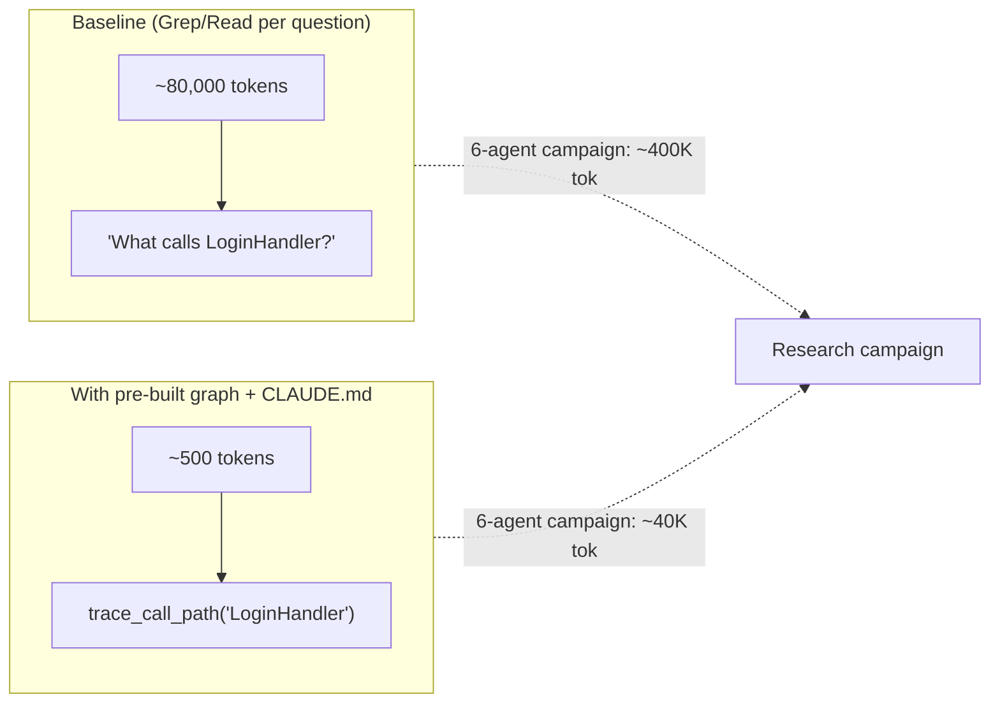
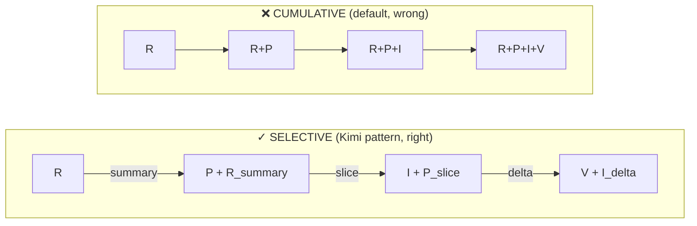
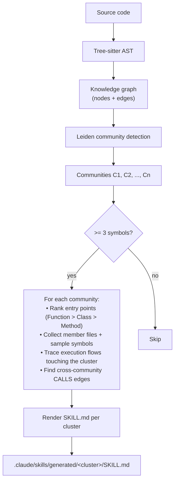
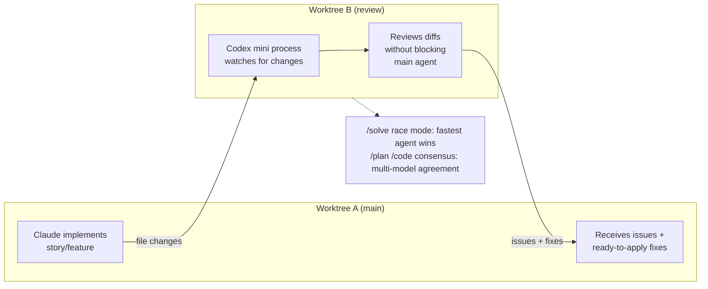
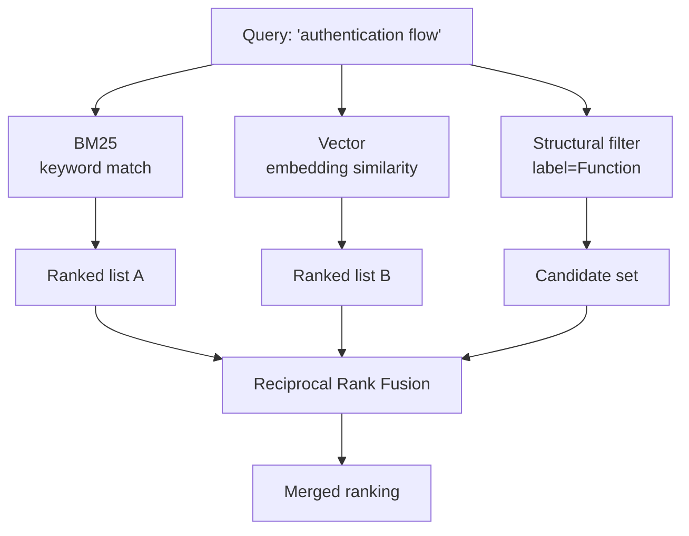
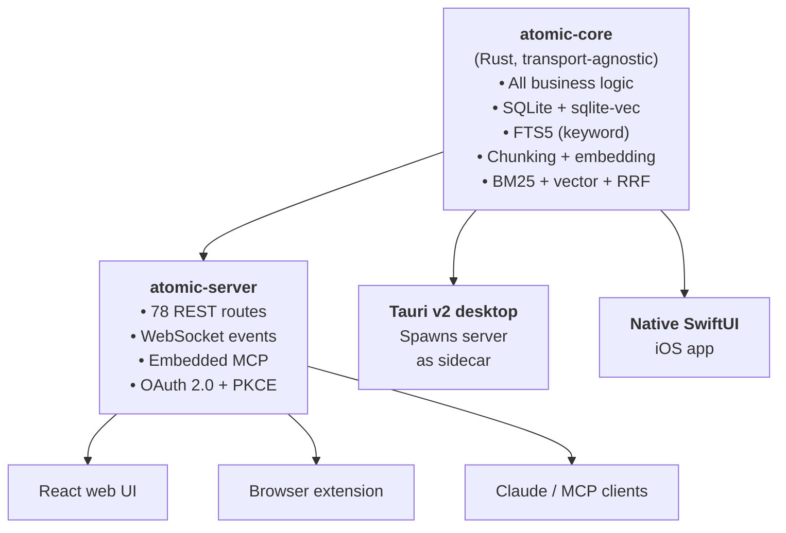

# Memory, Context Preservation, and Codebase Intelligence Research

> Research compilation for Prism plugin memory optimization and context preservation
> Date: 2026-04-11
> Companion to: [prism-code-intelligence-integration.md](./prism-code-intelligence-integration.md)
> Status: Reference — informs a future §13 "Adopted Patterns" addendum to the integration spec

---

## 0. Purpose

This document consolidates two parallel research passes conducted on 2026-04-11:

1. **Video research** — 7 YouTube videos on memory systems, codebase wikis, attention/retrieval design, and graph-based code intelligence
2. **Non-video research** — 8 GitHub repos / websites covering visualization, wiki generation, context packing, cross-model orchestration, graph intelligence, and personal knowledge bases

Both passes were motivated by a single question:

> How do we improve Prism's memory optimization and context preservation without burning tokens, while maintaining the best possible quality and efficiency of codebase understanding?

The existing integration spec ([prism-code-intelligence-integration.md](./prism-code-intelligence-integration.md)) already commits Prism to a graph-first code intelligence layer via codebase-memory-mcp. This document does not replace that spec — it adds external-world validation, identifies specific gaps, and enumerates concrete adoption targets.

---

## 1. Video Research Summary

### 1.1 Sources

| # | Video ID | Topic cluster |
|---|---|---|
| 1 | `2IfAVV7ewO0` | Graph-based code intelligence (Graphify) |
| 2 | `mIWxxwNtKUg` | Graph-based code intelligence (Graphy) |
| 3 | `EKbQ5sajVxA` | GitNexus walkthrough |
| 4 | `QPxtg4wNcMg` | Byterover cross-model memory |
| 5 | `iPunXq5MMv4` | Kimi attention-residual block design |
| 6 | `b6sQIuPSbzE` | OpenClaw — 1M-line vibe-coded codebase |
| 7 | `7D4D69qni-0` | Onchain AI Garage — LLM wiki vs vector RAG |

Viewer session (while running): `http://127.0.0.1:5123?session=2026-04-11_comparison-ai-search-github-awesome-char`

Stats: 10 topics, 3 disagreements, 22 key moments across 7 videos.

### 1.2 Cross-video signals (in order of convergence strength)

#### Signal 1 — Index once, query cheaply (~70x token reduction)

Graphify, Graphy, and GitNexus independently converge on roughly **70–71x fewer tokens per query** when a pre-built local graph is referenced via `CLAUDE.md`, versus file-by-file Glob/Grep exploration.



<details><summary>ASCII fallback</summary>

<pre>
THE 70X LEVER

Baseline (Grep/Read per question):
  [~80,000 tok] --> "What calls LoginHandler?"

With pre-built graph + CLAUDE.md pointer:
  [~500 tok]    --> trace_call_path("LoginHandler")

Applied across a 6-agent research campaign:
  Before: ~400,000 tokens
  After:  ~40,000 tokens
</pre>

</details>

**Prism applicability**: Validates the integration spec's core assumption. The rule "always `index_repository` at session start + after implementation, never grep for structural questions" should be doctrine, not preference. A hook that fails loudly if a research agent uses Grep on a structural question without first attempting `search_graph` is worth considering.

#### Signal 2 — Selective retrieval beats cumulative context (Kimi insight)

Kimi's attention-residual work validates the principle that each phase agent should load only its slice, not everything prior. Their "50 chefs" analogy maps directly to a long Claude session re-reading everything on every prompt.



<details><summary>ASCII fallback</summary>

<pre>
CUMULATIVE vs SELECTIVE RETRIEVAL

CUMULATIVE (the default, wrong):
  Research → Plan → Implement → Validate
    ▼         ▼         ▼           ▼
  [R]     [R+P]    [R+P+I]    [R+P+I+V]

  Context grows linearly; each phase re-reads
  everything that came before.

SELECTIVE (the Kimi pattern, right):
  Research → Plan → Implement → Validate
    │         │         │           │
    ▼         ▼         ▼           ▼
  [R] ──► [P+R_summary] ──► [I+P_slice] ──► [V+I_delta]

  Each phase receives only the exact slice it
  needs. Summaries bridge the gaps.
</pre>

</details>

**Prism applicability**: Formalize "per-phase retrieval manifests" that list exactly which `.prism/shared/` files each agent may read. A research agent shouldn't load prior plans; an implementer shouldn't load raw research transcripts. `/prism-spectrum` already follows this pattern via `progress.md` — don't broaden context between stories.

#### Signal 3 — Graph-derived skills and wikis (GitNexus `--skills`)

GitNexus auto-generates one Claude skill file per detected code community (Leiden clustering) and refreshes them on every reindex. The agent receives living, zero-maintenance domain guides.



<details><summary>ASCII fallback</summary>

<pre>
GRAPH → SKILLS PIPELINE

Source code
    ▼
Tree-sitter AST
    ▼
Knowledge graph (nodes + edges)
    ▼
Leiden community detection ──► Communities [C1, C2, ..., Cn]
    ▼
For each community with >= 3 symbols:
  ├─ Rank entry points (Function > Class > Method)
  ├─ Collect member files + sample symbols
  ├─ Trace execution flows touching the cluster
  └─ Find cross-community CALLS edges
    ▼
Render SKILL.md per cluster
    ▼
.claude/skills/generated/&lt;cluster&gt;/SKILL.md
</pre>

</details>

**Prism applicability**: This is a net-new capability for Prism. A new `scripts/prism-sync-skills.py` script can read communities from codebase-memory-mcp's Cypher interface and write skill files to `skills/generated/`. See §4 for details.

#### Signal 4 — Architecture as memory scaffold (OpenClaw)

OpenClaw's 1M-line vibe-coded codebase survived because its creator evolved explicit architectural buckets (layered → gateway → plugin). Structure itself becomes a form of memory: "where does this go?" is answered by the directory hierarchy, not by re-reading the whole project.

**Prism applicability**: Prism's `.prism/shared/` already mirrors this — research/plans/validation/handoffs are the buckets. Double down: forbid freeform files at the shared root, enforce `YYYY-MM-DD-topic.md` naming. When you don't know where something goes, you need a new bucket, not a new file in an old bucket.

#### Signal 5 — LLM wiki vs vector RAG (scale breakpoint)

Onchain AI Garage nails the distinction:

- **Curated wiki wins below ~few-hundred sources** (model reads a TOC, picks pages)
- **Vector RAG wins at massive scale**

**Prism applicability**: `.prism/shared/research/` is already a wiki-style pattern. Keep it index-first (a manifest with summaries) rather than embedding everything, at least until a project exceeds a few hundred research docs.

#### Signal 6 — Shared memory between agents (Byterover pattern)

Byterover demonstrates Claude Code (plan/implement) and Codex (review) handing off via one MCP memory store. Their clever trick: **chunk the plan into ~5 parts** before handoff, so the reviewing agent retrieves only the relevant slice.

**Prism applicability**: `/prism-subagent` could pre-slice large plans into per-task chunks. The reviewing agent queries by slice ID rather than loading the full plan. See also §3 (just-every/code's Auto Review pattern) for the concrete implementation reference.

#### Signal 7 — Attention residual blocks (Kimi bandwidth lesson)

Kimi found that pure cross-layer attention blows up cross-rack bandwidth, so they group layers into **blocks that communicate via summaries**.

**Prism applicability**: `/prism-spectrum` iterations shouldn't read every prior story's full artifacts — they should read a rolling summary (`progress.md` already does this) plus only the current story's details. Resist the urge to broaden context between stories.

#### Signal 8 — Dataview-style generated dashboards (LLM-wiki)

The LLM-wiki video showcased a Dataview dashboard surfacing low-confidence pages, source counts, and tag breakdowns from YAML frontmatter — automatic maintenance visibility without manual audits.

**Prism applicability**: If plans and research docs carry frontmatter (status, confidence, phase, linked-stories), the CLI dashboard could auto-generate "stale plans", "low-confidence research", "unlinked validation reports". Makes maintenance visible without manual audits.

#### Signal 9 — CLAUDE.md as the integration seam

Both Graphy and GitNexus make `CLAUDE.md` the one file the agent reads to discover everything else — graph paths, skills, hooks. The single integration point is a design virtue, not a limitation.

**Prism applicability**: Prism's CLAUDE.md already does a light version. Consider letting `/prism-init` inject a small generated block ("codebase-memory-mcp graph is at X, use `search_graph` before grep") so fresh sessions are never amnesiac about the tool contract. See §4 for the live-stats injection pattern.

---

## 2. Non-Video Research Summary

### 2.1 Sources and category map

| Tool | Category | Prism overlap | Net-new to Prism? |
|---|---|---|---|
| [code-insights.app](https://code-insights.app/) / [melagiri/code-insights](https://github.com/melagiri/code-insights) | Session retrospection | — | **Yes** — behavioral intel, not structural |
| [docs.devin.ai/deepwiki-mcp](https://docs.devin.ai/work-with-devin/deepwiki-mcp) | Narrative wiki (cloud, public repos) | web-search-researcher | Partial — OSS dependency research only |
| [regenrek/codefetch](https://github.com/regenrek/codefetch) | Cold-start repo snapshot | pre-research orientation | Minor — niche tool |
| [just-every/code](https://github.com/just-every/code) | Codex fork + multi-agent orchestrator | Full stack overlap | No — **pattern reference** |
| [osanoai/multicli](https://github.com/osanoai/multicli) | MCP bridge between CLIs | — | Yes — zero-config cross-model |
| [abhigyanpatwari/GitNexus](https://github.com/abhigyanpatwari/GitNexus) | Graph code intel (same as codebase-memory-mcp) | Direct competitor | **Yes — 5 concrete features** |
| [kenforthewin/atomic](https://github.com/kenforthewin/atomic) | Personal knowledge base + MCP | — | **Synaptiq reference impl** |

### 2.2 code-insights — session retrospection, not structural intelligence

**What it is**: A session-intelligence tool that ingests AI coding conversation logs (Claude Code JSONL, Cursor SQLite, Copilot) and runs LLM analysis to extract decisions, learnings, and friction points. Terminal CLI + React/Vite web dashboard. All data stays local in `~/.code-insights/data.db` (SQLite). Hooks into Claude Code's PostToolUse/session-end lifecycle.

**Outputs**: Prompt Quality scores (5 dimensions), recurring pattern detection, auto-generated CLAUDE.md/`.cursorrules` files, and an "AI Fluency Score" characterizing working style.

**How it differs from codebase-memory-mcp**: Orthogonal tools. codebase-memory-mcp answers "what does this code do structurally?" Code Insights answers "how did the developer think during these sessions?" Zero codebase structure analysis; no call graphs, no AST parsing.

**Prism applicability**:
- Auto-generated CLAUDE.md from session behavior — `/prism-finish` or a new `/prism-reflect` command could propose CLAUDE.md amendments based on what actually worked
- PostToolUse hook for session indexing — Prism already has hooks; Code Insights shows how to wire a session-end hook into a local SQLite accumulator
- "Session character" classification — tagging sessions as bug-hunt, feature-build, or exploration is a label `.prism/local/` journal could adopt
- Prompt Quality rubric (context provision, scope management, correction quality) is the most transferable concept — a lightweight scoring pass after `/prism-validate` could tell users where their prompts degraded

**Bottom line**: Not a visual codebase understanding tool. Won't plug into the Bubble Tea dashboard in any graph-visual way. Integration opportunity is behavioral/retrospective intelligence, not structural.

### 2.3 DeepWiki MCP — narrative layer for public dependency repos

**What it is**: A cloud-hosted remote MCP service built by Cognition AI (Devin). Pre-indexes public GitHub repositories and exposes their wiki content at `https://mcp.deepwiki.com/mcp`. No local install; your AI client connects to Cognition's hosted service.

**How wikis are generated**: LLM-generated summaries of repository content — conceptual/narrative documentation, not structural graph traversal. Karpathy-style curated narrative docs.

**Cost**:
- Free, no auth — public repos
- Private repos require a paid Devin subscription (Core plan ~$20 minimum, ~$2.25/ACU) via the separate Devin MCP server

**Comparison table**:

| Dimension | codebase-memory-mcp | DeepWiki MCP |
|---|---|---|
| Scope | Your private repo | Public repos only (free) |
| Output type | Structural graph | Conceptual wiki pages |
| Query style | Graph traversal, blast-radius, dead code | Natural language Q&A |
| Runs locally? | Yes | No — cloud only |
| Freshness | On-demand index | Cognition-controlled re-index |
| Narrative docs | You write them (.prism/shared/) | Auto-generated |

**MCP tool signatures**:
- `read_wiki_structure(owner, repo)` — topic/section outline
- `read_wiki_contents(owner, repo)` — full generated documentation
- `ask_question(owner, repo, question)` — LLM-grounded answer

**Prism applicability**: Wire `ask_question` into `web-search-researcher` as an optional tool when researching public OSS dependencies. Not a replacement for local research docs — it fills the gap codebase-memory-mcp leaves (structural but not conceptual) **for external repos only**.

### 2.4 codefetch — cold-start repo snapshot tool

**What it is**: TypeScript CLI/SDK that packs a local or remote codebase into a single structured markdown file for LLM context.

**Pipeline**: collect files → filter (`.gitignore` + `.codefetchignore` + custom) → count tokens → format into XML-tagged markdown → write output. No Tree-sitter or AST parsing — straight file concatenation.

**Output format**: Single `.md` with `<filetree>`, `<source_code>`, optional `<task>` XML envelope. Token count reported alongside.

**Filtering**: No ranking or relevance scoring. Dump-everything within budget. Two strategies:
- **Sequential** — stops adding files when token limit hit
- **Truncated** — distributes token budget evenly, truncating each file

**Niche comparison**:

| Approach | Strength | Weakness |
|---|---|---|
| codefetch | One-shot full snapshot, no per-file tool calls | No semantic query, no ranking, truncation risk |
| Grep+Read | Targeted, retrieves only what is needed | Many sequential tool calls, high latency |
| codebase-memory-mcp | Graph queries, call-path tracing, dead-code detection | Requires indexing, ~500 tokens/query overhead |

**Key CLI flags**: `--max-tokens`, `-e ts,go,py`, `-t [depth]`, `--token-encoder`, `-d/--dry-run`, `--url`, `--enable-line-numbers`.

**Prism applicability**: Occupies the "orientation snapshot" niche — cheapest way to give an agent a filetree + broad source dump before it knows what to look for. Fits as an optional `prism-research --cold-start` flag for brand-new repos where the graph isn't yet indexed. Best for small-to-medium repos (<150 files).

### 2.5 just-every/code — Codex fork with Auto Review worktree pattern

**What it is**: A community-maintained fork of OpenAI's Codex CLI. Keeps Codex as the primary shell but extends it with multi-agent orchestration, browser tooling, a skills discovery system, and an **Auto Review background process**. Syncs upstream from Codex every 30 minutes automatically.

**Model/provider support**: OpenAI natively; Claude/Gemini via companion CLIs (`@anthropic-ai/claude-code`, `@google/gemini-cli`); any OpenAI-compatible endpoint via config.

**Memory/state layers**:
- In-session conversation history
- `~/.code/config.toml` config
- SQLite `StateDB` for session metadata
- `.jsonl` files in `~/.code/sessions/` for recordings
- Project-root `AGENTS.md` / `CLAUDE.md` files

Cross-model state is **implicit** — each agent re-reads project files; no shared running memory bus.

**Plugin model**: Skills system (`SkillsManager`) discovers `SKILL.md` files in `.agents/skills/` with scope levels (Repo, User, System, Admin) — **structurally identical to Prism's `skills/*/SKILL.md` pattern**. Also supports MCP as both client and server.

**Standout feature — Auto Review**:



<details><summary>ASCII fallback</summary>

<pre>
AUTO REVIEW WORKTREE PATTERN

  Worktree A (main)              Worktree B (review)
  ─────────────────              ───────────────────
  Claude implements  ──┐         Codex mini process
  story/feature        │         watches for changes
                       │
  Files change ────────┴────────► Reviews diffs
                                  without blocking
  ◄────────────┐                  main agent
               │
  Receives     └──────────────── Delivers issues +
  issues + fixes                 ready-to-apply fixes

/solve race mode: fastest agent wins
/plan, /code consensus mode: multi-model agreement
</pre>

</details>

**Prism applicability**: **The concrete reference implementation for adding a Codex review pass to Spectrum**. The plumbing maps almost directly — separate worktree, watch for changes, deliver fixes back. This is the Byterover cross-model pattern implemented concretely. The skills discovery pattern is structurally identical to Prism's; the `/solve` race mode is novel scheduling worth considering.

### 2.6 osanoai/multicli — MCP bridge between coding CLIs

**What it is**: An **MCP server**, not a CLI or agent. Bridge layer that makes each installed coding CLI (Claude Code, Gemini CLI, Codex CLI, OpenCode) available as callable MCP tools to whichever agent is currently running. Self-describes: "Claude, Gemini, Codex, and OpenCode calling each other as tools."

**Model/provider support**: Whatever CLIs are installed on `$PATH`. Auto-detection at startup, no manual config. Nightly CI job republishes within 24 hours when models change.

**Memory/state**: **None**. Stateless stdio transport per request. No session persistence. Each tool call is a discrete subprocess invocation. Fundamental architectural limitation for multi-phase pipelines.

**Standout details**:
- **Self-hiding tool rule** — tools for the calling CLI are suppressed to prevent circular self-queries. A clean anti-pattern guard worth stealing.
- **Zero-config auto-detection** — would make any cross-model feature opt-in with no setup friction.

**Prism applicability**: Add to `.mcp.json`, enable Claude to call `/ask-codex` mid-session for a discrete second opinion. Zero Prism core changes. Limitation: stateless, so use only for one-shot review calls, not multi-phase handoffs.

### 2.7 GitNexus — richer than codebase-memory-mcp in 5 specific ways

**What it is**: TypeScript/Node.js (NOT Go) graph code intelligence engine with WASM browser mode. Tree-sitter parser, LadybugDB backing store (SQLite variant), 15+ languages, installed per-project in `.gitnexus/` and globally in `~/.gitnexus/registry.json`.

**Ingestion pipeline**: scan → parallel AST workers → import resolution → type resolution (Tarjan's for cycles) → community detection → process tracing → BM25+embedding indexing.

**Key differentiators from codebase-memory-mcp** (all five are actionable gaps for Prism):

#### Gap 1: Auto-generated community-aware skill files

Source: [`gitnexus/src/cli/skill-gen.ts`](https://github.com/abhigyanpatwari/GitNexus/blob/main/gitnexus/src/cli/skill-gen.ts)

Trigger: `gitnexus analyze --skills`

Pipeline: reads Leiden communities → filters to >= 3 symbols → takes top 20 by symbol count → for each community: extracts members, files, entry points (Functions > Classes > Methods > Interfaces), execution flows, cross-community CALLS → renders structured `SKILL.md` with YAML frontmatter.

Output path: `.claude/skills/generated/{kebab-community-name}/SKILL.md`

Skill file shape:
```
---
name: <kebab-label>
description: <auto-generated>
---

## When to Use
[dominant directories, key function names]

## Key Files
[table: top 10 files + sample symbols]

## Entry Points
[top 5 exported symbols]

## Key Symbols
[table: up to 20 members with type, file, line]

## Execution Flows
[processes touching this community]

## Connected Areas
[cross-community CALLS edges]

## How to Explore
[example gitnexus_query() calls]
```

**Classification**: Standalone addition for Prism. codebase-memory-mcp exposes communities via `search_graph`/`query_graph` but does not write skill files.

#### Gap 2: Live-stats CLAUDE.md injection with marker protocol

Source: [`gitnexus/src/cli/ai-context.ts`](https://github.com/abhigyanpatwari/GitNexus/blob/main/gitnexus/src/cli/ai-context.ts)

Idempotent marker pattern:
```html
<!-- gitnexus:start -->
[auto-generated content — refreshes on every reindex]
<!-- gitnexus:end -->
```

`upsertGitNexusSection()` handles three cases: file doesn't exist, file exists without markers (append), file exists with markers (replace between markers). User content outside markers is preserved.

Injected content includes:
- Live symbol/relationship/process counts (from current index)
- RFC 2119 mandatory workflows (`MUST run gitnexus_impact before editing any symbol`)
- Tool reference table with exact call signatures
- Risk classification table
- Resource URIs
- Pre-task self-verification checklist

**Classification**: Standalone addition for Prism. Prism's CLAUDE.md graph section is currently static prose. A small Python script in `scripts/` can query `list_projects` from codebase-memory-mcp, format a stats block, and do marker-aware upsert on CLAUDE.md. Wire into `prism-init` or a PostToolUse hook.

#### Gap 3: Hybrid BM25 + vector + Reciprocal Rank Fusion search

codebase-memory-mcp offers `search_graph` (structural/keyword) and `search_code` (grep-like text), but **no embedding-based semantic search and no RRF result merging**. GitNexus's `query` tool combines BM25, ONNX embeddings (optionally GPU-accelerated), and RRF in a single call. "Find the authentication flow" returns conceptually relevant results even when no symbol is literally named "auth".



<details><summary>ASCII fallback</summary>

<pre>
HYBRID SEARCH (BM25 + VECTOR + RRF)

Query: "authentication flow"
    │
    ├─────────────┬─────────────┐
    ▼             ▼             ▼
 BM25          Vector       Structural filter
 keyword       embedding    label=Function
 match         similarity
    │             │             │
    ▼             ▼             ▼
 Ranked        Ranked       Candidate set
 list A        list B
    │             │             │
    └──────┬──────┴─────────────┘
           ▼
     Reciprocal Rank Fusion
           ▼
     Merged ranking
</pre>

</details>

**Classification**: The most expensive gap to close. Two paths:
- (a) wait for codebase-memory-mcp to add embeddings upstream
- (b) run GitNexus alongside codebase-memory-mcp in `.mcp.json` — structural queries hit Prism's MCP, semantic queries hit GitNexus's. Dual-tool cost, low effort.

#### Gap 4: `detect_changes` as a behavioral hard gate

codebase-memory-mcp already has a `detect_changes` tool. GitNexus differs by **enforcing it as a behavioral contract** in the injected CLAUDE.md block with RFC 2119 `MUST` language, plus installing a PostToolUse Claude Code hook that surfaces violations at the tool-call level.

**Classification**: Wrapper around existing infrastructure. Prism has PostToolUse hooks (7 total); wiring graph verification into them is a small addition that makes the integration spec's advisory prose enforced.

#### Gap 5: `gitnexus wiki` — LLM-summarized graph-derived module documentation

Command: `gitnexus wiki [path]`
Source: [`gitnexus/src/cli/wiki.ts`](https://github.com/abhigyanpatwari/GitNexus/blob/main/gitnexus/src/cli/wiki.ts)

HTML output (not Markdown) in `.gitnexus/wiki/` with `index.html` viewer and `module_tree.json` intermediate. The `--review` flag lets users edit `module_tree.json` to prune or rename modules before the LLM summarization pass runs — human-in-the-loop gate. LLM is configurable: defaults to `gpt-4o-mini`, supports OpenRouter, Azure, custom endpoints.

**Classification**: Standalone addition. Prism has no equivalent; closest is `.prism/shared/research/` which is agent-prose, not structured and keyed to graph modules. A new `/prism-wiki` command can call `get_graph_schema` + `query_graph` to enumerate communities, then use Claude (not a separate LLM API key) to summarize each into Markdown in `.prism/shared/docs/`.

#### Other GitNexus notes

- **Language**: TypeScript/Node, NOT Go. Prism's CLI is Go; GitNexus cannot be embedded, only called as a subprocess or MCP server.
- **Community detection**: Uses **Leiden** (via vendored `graphology-communities-leiden`), not Louvain. Leiden guarantees well-connected communities; Louvain can produce internally disconnected ones. Meaningful algorithmic difference — Leiden produces higher-quality skill files.
- **License**: PolyForm Noncommercial. Patterns can be adopted, code cannot be copied. All gap items above describe patterns, not code to lift.
- **Refresh cadence gap**: Skill files only refresh when `--skills` is explicitly passed. The PostToolUse hook triggers plain `gitnexus analyze` without it — a limitation Prism's implementation could improve on by always regenerating on reindex.

### 2.8 kenforthewin/atomic — Synaptiq reference implementation

**What it is**: A self-hosted personal knowledge base that ingests markdown notes ("atoms"), chunks and embeds them into a SQLite vector store, and surfaces them through semantic search, a force-directed graph canvas, AI-generated wiki articles, and an agentic RAG chat interface.

**Architecture — the "Core + Thin Wrappers" monorepo pattern**:



<details><summary>ASCII fallback</summary>

<pre>
ATOMIC MONOREPO STRUCTURE

              ┌──────────────────────────────┐
              │       atomic-core            │
              │  (Rust, transport-agnostic)  │
              │                              │
              │  • All business logic        │
              │  • SQLite + sqlite-vec       │
              │  • FTS5 (keyword)            │
              │  • Chunking + embedding      │
              │  • BM25 + vector + RRF       │
              └──────────────┬───────────────┘
                             │
           ┌─────────────────┼─────────────────┐
           ▼                 ▼                 ▼
     atomic-server      Tauri v2          Native SwiftUI
     • 78 REST routes   desktop           iOS app
     • WebSocket        (spawns server
     • Embedded MCP      as sidecar)
     • OAuth 2.0 + PKCE
           │
           ├──────────┬──────────┐
           ▼          ▼          ▼
       React web  Browser    Claude / MCP
       UI         extension  clients
</pre>

</details>

**What makes it distinct**: Hybrid BM25 + vector search via RRF, built-in MCP server (Claude can query your knowledge graph directly), zero-dependency local-first (single SQLite file, no cloud), LLM-synthesized wiki articles from tagged atom clusters, full cross-platform delivery (desktop + mobile + web + browser extension).

**Griot mapping**: **Synaptiq**. Atomic is essentially the reference implementation of what Synaptiq is described as — agentic note-taking with visual nodes and knowledge-graph structure. Force-directed canvas, atom/chunk primitives, and RAG chat map almost 1:1 to Synaptiq's stated design goals.

**Integration opportunities**:
- MCP bridge into Prism: Atomic's embedded MCP server could feed a running Prism session with project-level research atoms
- Synaptiq architecture reference: `atomic-core` / `atomic-server` split is a clean model for Synaptiq's own Rust core with thin delivery wrappers
- Wiki synthesis for Prism plans: Atomic's tag-scoped wiki synthesis parallels what `/prism-brainstorm` produces manually
- sqlite-vec as local embedding store: production-viable at personal scale without a separate vector DB — relevant for Valence or Synaptiq

---

## 3. Synthesis

### 3.1 Summary signal alignment

The videos and the non-video research converge on the same set of patterns:

| Pattern | Video source | Tool implementing it | Prism status |
|---|---|---|---|
| Index once, query cheap | Graphify, Graphy, GitNexus | GitNexus, codebase-memory-mcp | ✓ committed in integration spec |
| Selective retrieval per phase | Kimi | (architectural principle) | Partial — `.prism/shared/` buckets exist |
| Graph → skills generation | GitNexus | GitNexus `--skills` | ✗ **gap** |
| CLAUDE.md as integration seam | Graphy, GitNexus | GitNexus ai-context | Partial — static prose only |
| Cross-model review via shared memory | Byterover | just-every/code Auto Review | ✗ **gap** |
| Plan chunking for handoff | Byterover | (pattern) | ✗ **gap** |
| Wiki vs RAG scale breakpoint | Onchain AI Garage | Atomic, DeepWiki | ✓ `.prism/shared/` already wiki-style |
| Rolling block summaries | Kimi | Prism spectrum progress.md | ✓ committed |
| Hybrid BM25 + vector + RRF | GitNexus | GitNexus, Atomic | ✗ **gap** |
| Frontmatter-driven dashboards | LLM-wiki | (pattern) | ✗ **gap** |
| Architecture as memory scaffold | OpenClaw | — | ✓ `.prism/shared/` buckets |

### 3.2 Actionable findings per Griot product

#### Prism — 5 concrete gaps from GitNexus worth closing

**1. Auto-generated community skills** (standalone addition, ~1-2 day build)
New script `scripts/prism-sync-skills.py` reads communities from codebase-memory-mcp's Cypher interface, clusters, writes `skills/generated/<cluster>/SKILL.md`. No code port — pattern is portable. GitNexus is PolyForm Noncommercial, so write from scratch. Note: codebase-memory-mcp uses Louvain, GitNexus uses Leiden — consider upstreaming a Leiden option to codebase-memory-mcp.

**2. Live-stats CLAUDE.md injection with marker protocol** (standalone addition, ~1 day)
`<!-- prism:start -->...<!-- prism:end -->` block that refreshes on every reindex with live node/edge counts, project health, and RFC 2119 `MUST` language for graph tool preference. Preserves user content outside markers. Wire into PostToolUse hook.

**3. Hybrid BM25 + vector + RRF search** (port/wrapper, most expensive gap)
The biggest structural gap. Two paths: (a) wait for codebase-memory-mcp to add embeddings upstream, (b) run GitNexus alongside codebase-memory-mcp in `.mcp.json` — structural queries hit Prism's MCP, semantic queries hit GitNexus's. Low effort, dual-tool cost.

**4. `detect_changes` as a behavioral hard gate** (wrapper, existing hook)
PostToolUse hook already exists; add a check that runs `detect_changes` and blocks on HIGH/CRITICAL. Makes integration spec §5.3 actually enforced instead of advisory.

**5. `/prism-wiki` command** (standalone, fits existing patterns)
Generate LLM-summarized module docs from graph communities, written to `.prism/shared/docs/`. Use Claude (no external API key, unlike GitNexus). Add a `--review` gate that lets the user edit `module_tree.json` before LLM synthesis runs — clean human-in-loop pattern.

#### Prism — other adoptions

- **just-every/code Auto Review worktree pattern** for `/prism-subagent` or Spectrum review stage: spawn Codex in a separate worktree, watch for changes, deliver issues + ready-to-apply fixes. Concrete Byterover pattern.
- **multicli as MCP transport**: add to `.mcp.json`, enable Claude to call `/ask-codex` mid-session for a second opinion. Zero Prism core changes. Limitation: stateless, so use only for discrete review calls.
- **codefetch pre-research pass**: `codefetch -t --max-tokens 80K -e ts,go,py` as a 1-shot orientation snapshot before spawning codebase-locator. Fits as optional `prism-research --cold-start` flag for brand-new repos.
- **code-insights "session character" + prompt quality scoring**: retrospective layer for `/prism-finish`. Score just-ended session on context provision / scope management / correction quality, propose CLAUDE.md amendments. New `/prism-reflect` command.
- **DeepWiki MCP for OSS deps**: add as optional tool on `web-search-researcher`. `ask_question(owner, repo, question)` for public dependency research. Free, no auth.

#### Synaptiq — adopt Atomic's architecture

Atomic's `atomic-core` (Rust, transport-agnostic, SQLite + sqlite-vec + FTS5) + thin wrappers (Tauri desktop, React web, SwiftUI iOS, browser extension, embedded MCP server) is exactly the shape Synaptiq needs:

- **Rust core with all business logic** — no duplicated logic across platforms
- **sqlite-vec for vectors** — single SQLite file, no separate vector DB, production-viable at personal scale
- **Hybrid BM25 + vector + RRF** — same pattern that makes GitNexus's semantic search work, applied to notes
- **Embedded MCP endpoint (OAuth 2.0 + PKCE)** — Claude / Valence / Prism can all query Synaptiq from inside a running session

Worth cloning and studying before finalizing Synaptiq's architecture.

#### Valence — cross-model observability hook

- **just-every/code's session recording** (`~/.code/sessions/*.jsonl` + SQLite StateDB) is the pattern Valence should observe — if Valence hooks into both Claude Code's session logs AND Codex's JSONL output, it can correlate multi-model workflows.
- **multicli's self-hiding tool guard** (suppress tools for the calling CLI to prevent circular self-queries) is the anti-pattern guard Valence's dispatch layer needs.

#### Fragment — no direct overlap
None of these 8 tools overlap with Fragment's scaffolding domain.

#### SkillForge — GitNexus skill-gen is the prior art
GitNexus auto-generates `.claude/skills/generated/<cluster>/SKILL.md` files with YAML frontmatter + structured sections. When SkillForge ships, it should manage both hand-authored skills AND auto-generated ones from graph communities. The generated ones need a "regenerate on reindex" lifecycle SkillForge should own.

#### Unnamed "Oracle" (ytmp4-ai-digest)
Atomic's wiki synthesis pipeline (tag-scoped LLM articles from atom clusters) is the same shape as cross-video digest synthesis.

### 3.3 Recommended next actions (ranked by ROI)

1. **Add GitNexus to `.mcp.json` alongside codebase-memory-mcp** — zero-risk dual-index experiment. 30 min. Validates the hybrid-search gap before building anything.
2. **Write `scripts/prism-sync-skills.py`** — generates per-community skill files from codebase-memory-mcp communities. Highest leverage, smallest build.
3. **Upgrade `CLAUDE.md` graph block to live-stats marker injection** — 1-day task, immediate feedback during every session.
4. **Prototype `/prism-reflect` using code-insights' prompt-quality rubric** — cheap experiment, high user-facing signal.
5. **Study Atomic before Synaptiq's architecture is locked in** — blocks a future rework.

---

## 4. Next steps

All 8 tools cross-checked against the existing integration spec at [prism-code-intelligence-integration.md](./prism-code-intelligence-integration.md). The spec doesn't need a full rewrite — it needs a §13 "Adopted Patterns" addendum covering items 1-5 from §3.3.

Potential follow-up research:
- Spin up GitNexus locally against the prism-plugin repo itself to validate the dual-index approach before committing
- Measure actual token reduction with live-stats CLAUDE.md injection vs static prose
- Evaluate codebase-memory-mcp's roadmap for embedding-based search (may close Gap 3 upstream)

---

## 5. Source index

### Videos (viewer session 2026-04-11_comparison-ai-search-github-awesome-char)
- Graphify — `2IfAVV7ewO0`
- Graphy — `mIWxxwNtKUg`
- GitNexus walkthrough — `EKbQ5sajVxA`
- Byterover cross-model memory — `QPxtg4wNcMg`
- Kimi attention-residual blocks — `iPunXq5MMv4`
- OpenClaw (1M-line codebase) — `b6sQIuPSbzE`
- Onchain AI Garage (LLM wiki vs RAG) — `7D4D69qni-0`

### Non-video sources
- [code-insights.app](https://code-insights.app/)
- [melagiri/code-insights GitHub](https://github.com/melagiri/code-insights)
- [melagiri/code-insights DeepWiki](https://deepwiki.com/melagiri/code-insights)
- [Devin DeepWiki MCP docs](https://docs.devin.ai/work-with-devin/deepwiki-mcp)
- [Cognition DeepWiki MCP blog](https://cognition.ai/blog/deepwiki-mcp-server)
- [regenrek/codefetch](https://github.com/regenrek/codefetch)
- [regenrek/codefetch DeepWiki](https://deepwiki.com/regenrek/codefetch)
- [just-every/code](https://github.com/just-every/code)
- [just-every/code DeepWiki](https://deepwiki.com/just-every/code)
- [osanoai/multicli](https://github.com/osanoai/multicli)
- [abhigyanpatwari/GitNexus](https://github.com/abhigyanpatwari/GitNexus)
- [abhigyanpatwari/GitNexus DeepWiki](https://deepwiki.com/abhigyanpatwari/GitNexus)
- [GitNexus skill-gen.ts](https://github.com/abhigyanpatwari/GitNexus/blob/main/gitnexus/src/cli/skill-gen.ts)
- [GitNexus ai-context.ts](https://github.com/abhigyanpatwari/GitNexus/blob/main/gitnexus/src/cli/ai-context.ts)
- [GitNexus community-processor.ts](https://github.com/abhigyanpatwari/GitNexus/blob/main/gitnexus/src/core/ingestion/community-processor.ts)
- [GitNexus wiki.ts](https://github.com/abhigyanpatwari/GitNexus/blob/main/gitnexus/src/cli/wiki.ts)
- [kenforthewin/atomic](https://github.com/kenforthewin/atomic)
- [kenforthewin/atomic DeepWiki](https://deepwiki.com/kenforthewin/atomic)
